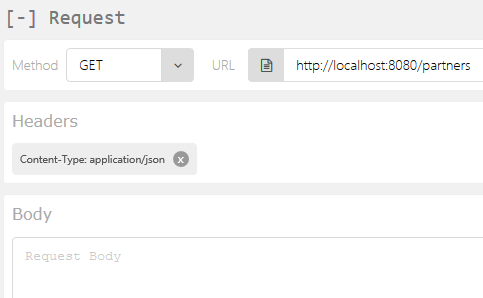
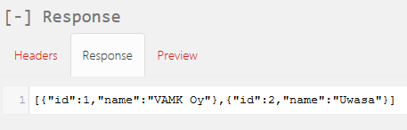
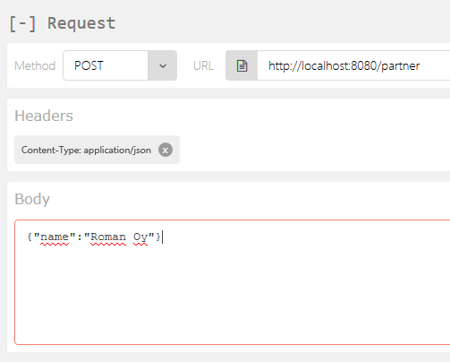
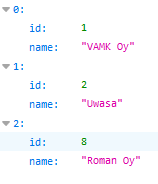
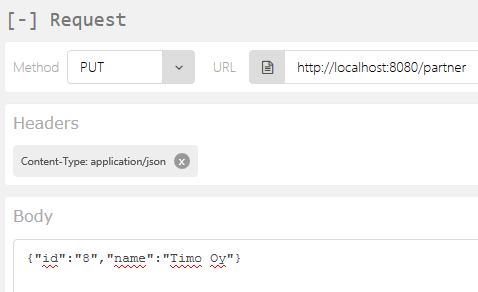
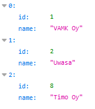
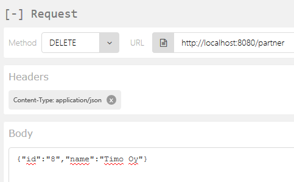
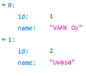

# Spring REST API Example

Example of [**REST API**](https://en.wikipedia.org/wiki/REST) implemented in Java using [**Spring**](https://spring.io/projects/spring-framework) framework and a [**MySQL**](https://www.mysql.com/) database.

## 📥 Installation instructions

1. Clone the repo to your local machine
2. Unzip the files

## 🛠 Configuration instructions

1. Create a file **_application.properties_**
2. Write the following contents to the file:

```properties
spring.datasource.url = 
spring.datasource.username = 
spring.datasource.password = 
spring.datasource.platform = mysql
spring.datasource.max-active = 100
spring.datasource.driverClassName = com.mysql.jdbc.Driver
spring.jpa.show-sql = true
spring.jpa.hibernate.naming-strategy = org.hibernate.cfg.ImprovedNamingStrategy
spring.jpa.properties.hibernate.dialect = org.hibernate.dialect.MySQL5Dialect
```

3. Configure the fields **spring.datasource.url**, **spring.datasource.username**, and **spring.datasource.password** accoring to your settings
4. Copy the file to directories **_./src/main/resources/_** and **_./src/test/resources/_**

## ⚙️ Operating instructions

### Building, launching, and shutting down

1. Go to the repo directory in a terminal
2. Run the following command to build the app

```bat
mvn package
```

3. Run the following command to launch the app

```bat
java -jar target/se-0.0.1-SNAPSHOT.jar
```

4. To stop the app, press "**Ctrl + C**" in the terminal

### Testing

You will need a browser for this purpose.
**Remark: _this step should be done only if you have successfully completed the 3rd step of the previous section_**.

#### Firefox

Download the [**REST API add-on**](https://addons.mozilla.org/en-US/firefox/addon/restclient/?src=search) from Mozilla Add-ons and launch it.

Go to **Headers > Custom Header** and enter the following values:

1. Name: **Content-Type**
2. Attribute Value: **application/json**

Tick the **Favorite header** checkbox and press **Okay**.

Open another tab with address **http://localhost:8080/partners**.

##### GET ALL

Select the following in the [**REST API add-on**](https://addons.mozilla.org/en-US/firefox/addon/restclient/?src=search) tab:



Press **Send**. The result in the [**REST API add-on**](https://addons.mozilla.org/en-US/firefox/addon/restclient/?src=search) tab should look like this:



##### GET

Select the following in the [**REST API add-on**](https://addons.mozilla.org/en-US/firefox/addon/restclient/?src=search) tab:


Press **Send**. The result in the [**REST API add-on**](https://addons.mozilla.org/en-US/firefox/addon/restclient/?src=search) tab should look like this:


##### POST

Select the following in the [**REST API add-on**](https://addons.mozilla.org/en-US/firefox/addon/restclient/?src=search) tab:



Press **Send**. The result on the localhost should look like this:



##### PUT

Select the following in the [**REST API add-on**](https://addons.mozilla.org/en-US/firefox/addon/restclient/?src=search) tab:



Press **Send**. The result on the localhost should look like this:



##### DELETE

Select the following in the [**REST API add-on**](https://addons.mozilla.org/en-US/firefox/addon/restclient/?src=search) tab:



Press **Send**. The result on the localhost should look like this:



## 🗃 File manifest

### Tree

```txt
.
├───.settings (8 files)
│   ├───org.eclipse.core.resources.prefs
│   ├───org.eclipse.jdt.apt.core.prefs
│   ├───org.eclipse.jdt.core.prefs
│   ├───org.eclipse.jpt.core.prefs
│   ├───org.eclipse.jpt.entitygen.new-mysql.mylocal
│   ├───org.eclipse.m2e.core.prefs
│   ├───org.eclipse.wst.common.project.facet.core.prefs.xml
│   └───org.eclipse.wst.common.project.facet.core.xml
├───bin (0 files)
│   └───target
│       ├───classes
│       │   ├───META-INF
│       │   └───se
│       ├───generated-sources
│       │   └───annotations
│       ├───maven-archiver
│       └───maven-status
│           └───maven-compiler-plugin
│               └───compile
│                   └───default-compile
├───img (10 files)
│   ├───DELETE_request_res.png
│   ├───DELETE_request.png
│   ├───GET_ALL_request_res.png
│   ├───GET_ALL_request.png
│   ├───GET_request_res.png
│   ├───GET_request.png
│   ├───POST_request_res.png
│   ├───POST_request.png
│   ├───PUT_request_res.png
│   └───PUT_request.png
├───src (6 files)
│   ├───main
│   │   ├───java
│   │   │   ├───META-INF
│   │   │   │   ├───additional-spring-configuration-metadata.json
│   │   │   │   └───persistence.xml
│   │   │   └───se
│   │   │       ├───Application.java
│   │   │       ├───Partner.java
│   │   │       ├───PartnerController.java
│   │   │       └───PartnerRepository.java
│   │   └───resources (here is supposed to be application.properties)
│   └───test
│       └───resources (here is supposed to be application.properties)
├───target (2 files)
│   ├───classes
│   │   ├───META-INF
│   │   │   ├───additional-spring-configuration-metadata.json
│   │   │   └───persistence.xml
│   │   └───se
│   └───test-classes
├───.classpath
├───.gitignore
├───.project
├───LICENCE
├───partner.sql
├───pom.xml
└───README.md
```

### Total: 33 files

## ⚖️ Copyright and licensing information

This project is licensed under the [**GNU General Public License**](https://en.wikipedia.org/wiki/GNU_General_Public_License). See the [**_LICENSE_**](LICENSE) file for details

## ⚠️ Known bugs and troubleshooting

### _Some classes are not found, can not build_

#### Problem

Dependencies are incorrect.

#### Solution

Change the contents of the following configuration files according to the error log and settings of your machine:

1. **_./.classpath_**
2. **_./.project_**
3. **_./pom.xml_**

### _Building is ok, but error appears while launching_

#### Problem

There is some problem in the build.

#### Solution

Try check dependencies again, and run the following command:

```bat
mvn clean
```

Build and launch again.

## 👏 Credits and acknowledgments

### Authors

- **Roman Bezusiak** - _Initial work_ - [Roman Bezusiak (GitHub profile)](https://github.com/roman-bezusiak)

### Used resources

- **[Wikimedia Foundation Inc.](https://wikimediafoundation.org/wiki/Home), Wikipedia** - _Encyclopedia materials_ - [wikipedia.org](https://www.wikipedia.org/)

### Used code

- **Spring** - _Spring framework_ - [Spring](https://spring.io/projects/spring-framework)
